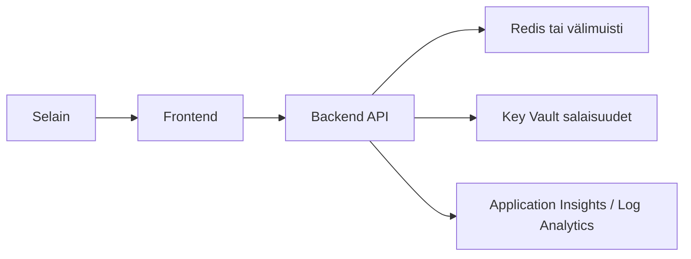
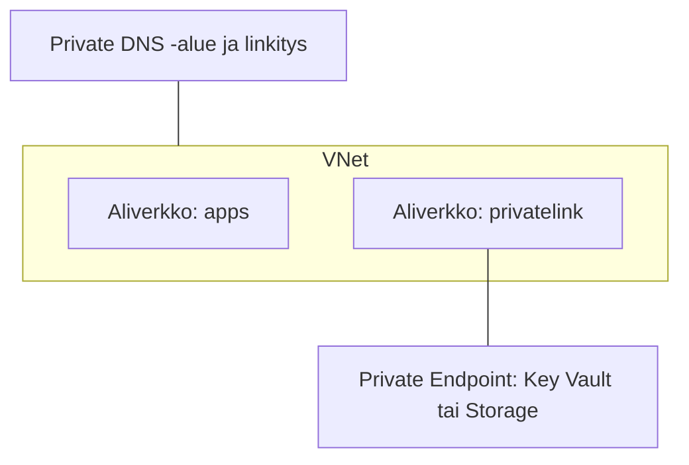

## Sovelluksen looginen arkkitehtuuri

```mermaid
flowchart LR
  User[Selain] --> FE[Frontend]
  FE --> BE[Backend API]
  BE --> Cache[Redis tai välimuisti]
  BE --> KV[Key Vault salaisuudet]
  BE --> Logs[Application Insights / Log Analytics]
```

## Verkko- ja turvakerrokset

```mermaid
flowchart TB
   VNet[(Azure Virtual Network)]
   subgraph VNet
     SubApps[Aliverkko: apps]
     SubPE[Aliverkko: privatelink]
   end
   PE[Private Endpoint: Key Vault tai Storage]
   DNS[Private DNS -alue ja linkitys]
   SubPE --- PE
   DNS --- VNet
```
